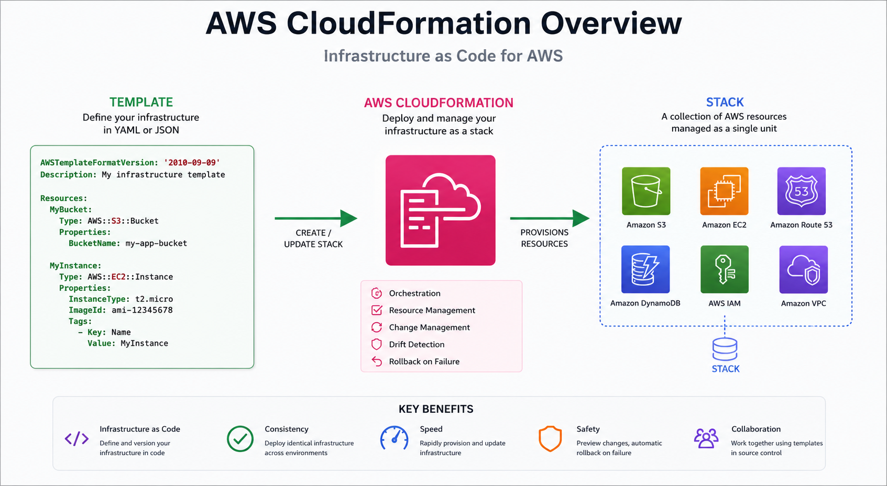

# How AWS CloudFormation Changed My Deployments Forever



## Introduction

Early in my cloud journey, I spent a lot of time creating AWS resources manually through the AWS Management Console. Whether it was launching EC2 instances, creating S3 buckets, configuring security groups, or setting up networking, every deployment involved a series of repetitive steps.

While this approach worked for small projects, it quickly became difficult to manage as environments grew. Recreating infrastructure consistently across development, testing, and production environments became challenging, and the risk of human error increased with every deployment.

Everything changed when I discovered AWS CloudFormation.

CloudFormation introduced me to the concept of Infrastructure as Code (IaC), allowing me to define my infrastructure in templates and deploy resources automatically. What started as a simple curiosity soon became one of the most valuable tools in my cloud engineering toolkit.

---

## What is CloudFormation?

AWS CloudFormation is an Infrastructure as Code (IaC) service that enables you to model, provision, and manage AWS resources using code.

Instead of manually creating resources through the AWS Console, you define them in a YAML or JSON template. CloudFormation then provisions and manages those resources as a single unit called a **Stack**.

### Benefits of CloudFormation

* Infrastructure becomes version controlled
* Deployments become repeatable
* Environments remain consistent
* Resources can be recreated easily
* Infrastructure changes become auditable
* Teams can collaborate through Git workflows

Example:

```yaml
AWSTemplateFormatVersion: '2010-09-09'

Resources:
  DemoBucket:
    Type: AWS::S3::Bucket
```

With just a few lines of code, CloudFormation can provision resources that would otherwise require multiple manual steps.

---

## Why I Started Using It

My motivation for learning CloudFormation came from a simple problem: I wanted consistency.

I noticed that every deployment required me to remember numerous configuration settings. If I forgot a setting or misconfigured a resource, troubleshooting could consume valuable time.

Some common challenges I faced included:

* Repeating the same deployment tasks
* Keeping development and production environments aligned
* Remembering resource configurations
* Documenting infrastructure changes
* Recovering from accidental deletions

I realized that infrastructure should be treated the same way as application code:

* Stored in Git
* Reviewed through pull requests
* Version controlled
* Automated whenever possible

CloudFormation provided exactly that.

---

## Traditional Deployment Problems

Before Infrastructure as Code, my deployment process often looked like this:

```text
AWS Console
    ↓
Create VPC
    ↓
Create Subnets
    ↓
Create Security Groups
    ↓
Launch EC2 Instances
    ↓
Configure Networking
    ↓
Create Storage Resources
    ↓
Verify Everything Works
```

Although straightforward, this approach introduced several problems.

### Human Error

Manual deployments increase the likelihood of mistakes. A missed configuration or incorrect setting can lead to unexpected issues.

### Configuration Drift

Over time, environments begin to differ because resources are modified manually without proper documentation.

### Slow Recovery

If resources are deleted accidentally, rebuilding them manually can be time-consuming.

### Lack of Version Control

Without Infrastructure as Code, it is difficult to track infrastructure changes or roll back to previous configurations.

---

## How CloudFormation Solved Them

CloudFormation transformed my deployment process by making infrastructure declarative and repeatable.

### Infrastructure as Code

Instead of manually creating resources, I define them once in a template.

```yaml
Resources:
  WebServer:
    Type: AWS::EC2::Instance
    Properties:
      InstanceType: t2.micro
      ImageId: ami-xxxxxxxx
```

Once defined, the same infrastructure can be deployed repeatedly with confidence.

---

### Environment Separation

One of my favorite features is parameterization.

```yaml
Parameters:
  Environment:
    Type: String
    AllowedValues:
      - dev
      - prod

Resources:
  AppBucket:
    Type: AWS::S3::Bucket
    Properties:
      BucketName: !Sub myapp-${Environment}
```

Using parameters allows the same template to support multiple environments while preventing naming conflicts.

---

### Change Tracking

CloudFormation maintains a record of deployed resources and infrastructure changes.

This makes it easier to:

* Review updates
* Identify changes
* Roll back deployments when necessary

---

### Consistency Across Environments

Because every environment uses the same template, I can be confident that development, testing, and production environments remain aligned.

This significantly reduces the "it works in development but not in production" problem.

---

### Faster Disaster Recovery

If infrastructure is lost or deleted, I can simply redeploy the stack.

```bash
aws cloudformation deploy \
  --stack-name my-environment \
  --template-file template.yaml
```

The ability to recreate infrastructure quickly provides confidence and reduces downtime.

---

## Lessons Learned

Working with CloudFormation taught me several important lessons about cloud engineering.

### Infrastructure Should Be Version Controlled

If infrastructure is important enough to run applications, it is important enough to store in Git.

---

### Automation Reduces Risk

The fewer manual steps involved in deployments, the fewer opportunities exist for mistakes.

---

### Consistency Matters

Reliable systems depend on predictable deployments. CloudFormation helps eliminate environmental inconsistencies.

---

### Documentation Can Be Code

CloudFormation templates serve as both deployment instructions and infrastructure documentation.

---

### Small Investments Save Significant Time

Although there is a learning curve, the time spent learning Infrastructure as Code pays dividends as projects grow.

---

## Conclusion

Learning AWS CloudFormation fundamentally changed how I approach cloud deployments.

It shifted my mindset from manually creating resources to defining infrastructure as code, enabling safer, more reliable, and more repeatable deployments.

Today, whenever I work in AWS, CloudFormation is one of the first tools I consider because it provides:

* Consistency
* Automation
* Version control
* Repeatability
* Improved operational confidence

The biggest lesson CloudFormation taught me is simple:

> Infrastructure should be treated like code.

Once you adopt that mindset, deploying and managing cloud resources becomes significantly easier, more scalable, and far less stressful.

---

## Repository Structure

```text
aws-cloudformation-changed-my-deployments-forever/
│
├── README.md
├── images/
├── templates/
├── examples/
├── docs/
└── LICENSE
```

---

## Connect With Me

If you're learning AWS, DevOps, Infrastructure as Code, or Cloud Engineering, feel free to connect and share your journey.

⭐ If you found this repository helpful, consider giving it a star.
